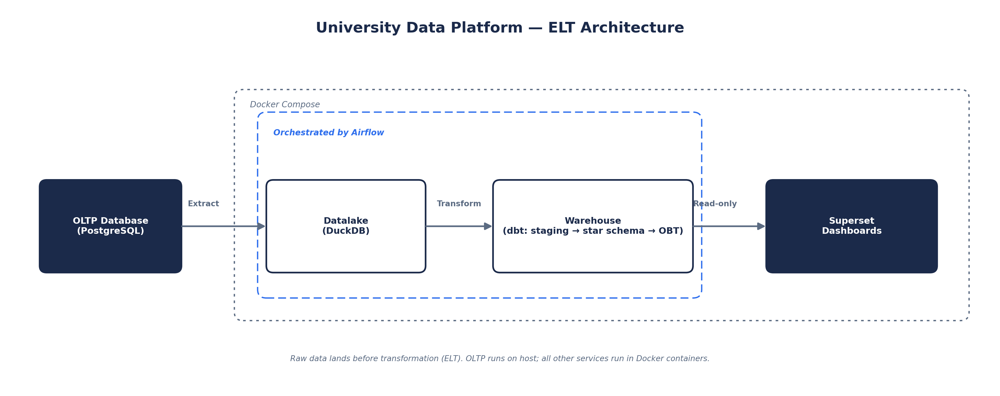

# US University ELT Analytics Platform

An end-to-end data platform that moves university enrollment, assessment, and program data from a transactional source system into an analytics-ready warehouse, with full historical tracking, automated data quality validation, and orchestrated scheduling.

> **Naming note**: this repository is named `US_University_ETL_Analytics` for historical reasons, but the pipeline is **ELT**, not ETL. Raw data is loaded before any transformation occurs. Repository rename pending.

## Architecture

- **OLTP (Postgres)** — transactional source system
- **Datalake (DuckDB, `raw_landed` schema)** — raw data landed as-is, before transformation
- **dbt snapshot** — SCD Type 2 history on `programs`
- **dbt run** — `staging` (views) → `warehouse` (star schema) → `obt` (denormalized, dashboard-ready)
- **dbt test** — 100 automated data quality tests
- **Superset** — read-only dashboards on the `obt` schema
- **Orchestration** — Apache Airflow (LocalExecutor), all of the above as one DAG

Two separate execution environments:
- Airflow, its metadata database, and dbt run inside Docker containers (Docker Compose)
- OLTP Postgres runs on the host, reached from containers via `host.docker.internal`
- Mirrors a realistic deployment boundary: owned infrastructure vs. an external source system



```
                        ┌──────────────────┐
                        │   OLTP Source    │
                        │   (PostgreSQL)   │
                        └──────────────────┘
                                  │
                                  ▼
   ┌────────────────────────────────────────────────────────────┐
   │            DATALAKE LAYER  (raw_landed, DuckDB)            │
   │                                                            │
   │    ┌──────────────────────┐    ┌──────────────────────┐    │
   │    │      Dimensions      │    │        Facts         │    │
   │    │    (full reload)     │    │    (incremental,     │    │
   │    │                      │    │     watermarked)     │    │
   │    └──────────────────────┘    └──────────────────────┘    │
   │                                                            │
   └────────────────────────────────────────────────────────────┘
                                  │
                                  ▼
   ┌────────────────────────────────────────────────────────────┐
   │                       STAGING LAYER                        │
   │                                                            │
   │  ┌──────────────────────────────────────────────────────┐  │
   │  │ Lightly cleaned views, one per source table          │  │
   │  └──────────────────────────────────────────────────────┘  │
   └────────────────────────────────────────────────────────────┘
                                  │
                                  ▼
   ┌────────────────────────────────────────────────────────────┐
   │                      WAREHOUSE LAYER                       │
   │                                                            │
   │  ┌──────────────────────────────────────────────────────┐  │
   │  │ SCD Type 2 snapshot on programs (dbt snapshot)       │  │
   │  │ Star schema: dimension + fact tables                 │  │
   │  │ 3 incremental facts (new/changed rows only)          │  │
   │  └──────────────────────────────────────────────────────┘  │
   └────────────────────────────────────────────────────────────┘
                                  │
                                  ▼
            ┌──────────────────────────────────────────┐
            │                 dbt test                 │
            │    100 automated data quality checks     │
            └──────────────────────────────────────────┘
                                  │
                                  ▼
   ┌────────────────────────────────────────────────────────────┐
   │                         OBT LAYER                          │
   │                                                            │
   │  ┌──────────────────────────────────────────────────────┐  │
   │  │ Wide, denormalized tables                            │  │
   │  │ One row per business entity                          │  │
   │  │ No joins needed at query time                        │  │
   │  │ Built for direct Superset consumption                │  │
   │  └──────────────────────────────────────────────────────┘  │
   └────────────────────────────────────────────────────────────┘
                                  │
                                  ▼
                     ┌────────────────────────┐
                     │        Superset        │
                     │ (read-only dashboards) │
                     └────────────────────────┘
```

Orchestrated end to end by Apache Airflow: `ingest_oltp_to_datalake >> dbt_snapshot >> dbt_run >> dbt_test`.

## Dashboards

Built on the `obt` schema, refreshed by the pipeline above.

**Active enrollment summary**


**Program graduation trends**


## Data mapping

Complete field-level mapping for every transition (OLTP → datalake → staging → warehouse → OBT), including source/target columns, data types, and calculated-metric definitions.

- Full mapping (read-only): [Google Sheet](https://docs.google.com/spreadsheets/d/1KNtPWFwnuou4snxDgdEr0M5RlZUQlSyc4-milvOgtno/edit?usp=sharing)
- Offline copy: `Docs/Final_Data_Mapping_Sheet.xlsx`

## Demo video

https://github.com/user-attachments/assets/4d7175f7-cd51-4a0b-ad77-8e9315f612e8

## Why ELT

- Raw data lands in `raw_landed` untouched, before any transformation
- Transformation happens afterward, in-warehouse, via dbt SQL — not embedded in extraction code
- Benefits:
  - Raw layer preserves an unmodified source copy; any downstream model can be rebuilt from it without re-querying the source
  - Transformation logic is version-controlled and testable through dbt

## Data flow

**Extraction and loading** (`Datalake/ingestion.py`)
- Dimension tables (`programs`, `subjects`, `semesters`, `students`, etc.) — full reload every run
- Fact tables (`program_enrollments`, `subject_enrollments`, `assessment_results`) — incremental, watermarked on `updated_at`, 10-minute lookback for late-committing transactions
- Raw fact layer is an append-only journal (every landed version kept) — not formal SCD2, since there are no explicit validity boundaries; that curation happens deliberately at the snapshot step

**History capture**
- `programs` snapshotted via dbt's native SCD Type 2 snapshot functionality
- Every attribute change preserved as a new row (`dbt_valid_from` / `dbt_valid_to`)

**Transformation** — three schemas, increasing refinement
- `staging` — lightly cleaned views, one per source table
- `warehouse` — dimension and fact tables, conventional star schema; three incremental fact tables reprocess only new/changed rows
- `obt` — wide, denormalized tables built for direct Superset consumption, no joins at query time

**Validation**
- 100 automated tests: not-null, accepted values, uniqueness, referential integrity, numeric range checks

**Presentation**
- Superset connects read-only — never contends with the pipeline for a write lock
- Dashboards built directly on `obt`

## Orchestration

Single Airflow DAG (`Airflow/dags/university_etl_pipeline.py`), four tasks, strict order:

```
ingest_oltp_to_datalake >> dbt_snapshot >> dbt_run >> dbt_test
```

- Each task runs the same commands used for local development — Airflow behavior matches manual runs
- `max_active_runs=1` — prevents overlapping runs from contending for the DuckDB write lock (a real collision found and fixed during development)
- Retries once after a 2-minute delay on failure
- Exhausted retries write a structured failure entry to the task log (`on_failure_callback`) — hook point for future email/Slack alerting

## Concurrency

DuckDB allows exactly one writer at a time, unlimited concurrent readers.

- Superset's connection is explicitly `read_only: true` — never competes with the pipeline for the write lock
- Any other tool inspecting the warehouse file directly (e.g., a database client) should connect read-only, especially while a pipeline run may be active

## Repository structure

```
US_University_ETL_Analytics/
├── OLTP/                    Source database schema and data generation
│   ├── prod_oltp_db.sql
│   ├── data_loader.py       Synthetic dataset generator (~577k subject
│   │                        enrollments, ~2.6M assessment results, with
│   │                        realistic retake and multi-program patterns)
│   └── seed_incremental.py  Small supplemental changes, for demonstrating
│                            incremental loads and SCD2 history
├── Datalake/
│   └── ingestion.py         OLTP -> DuckDB raw_landed extraction
├── Warehouse/                dbt project
│   ├── models/
│   │   ├── staging/
│   │   ├── warehouse/
│   │   └── obt/
│   ├── snapshots/
│   ├── tests/
│   └── docker_profiles/     Container-specific dbt profile
├── Storage/
│   └── warehouse.duckdb      Single-file analytical database
├── Airflow/
│   └── dags/
│       └── university_etl_pipeline.py
├── Superset/
│   └── Dockerfile
└── docker-compose.yaml
```

## Running the platform

Bring up the full stack:
```
docker compose up -d
```
- Starts Airflow (metadata DB, scheduler, DAG processor, API server) and Superset
- First run builds Airflow with `dbt-duckdb`, `duckdb`, `psycopg2-binary`; Superset with `duckdb-engine`, `psycopg2-binary`

Trigger a pipeline run — UI at `localhost:8080`, or:
```
docker exec -it airflow-scheduler airflow dags trigger university_etl_pipeline
```

Generate a small set of incremental changes for demonstration (run on host, OLTP at `localhost`):
```
cd OLTP
python seed_incremental.py
```
Renames one program, graduates one enrollment, adjusts one mark and one assessment score, and inserts a new semester with new students, offerings, and enrollments — one transaction.

## Known limitations

- `@daily` schedule not yet validated against a production cadence
- Failure alerting limited to structured log entries; email/Slack notification is a natural extension of the existing `on_failure_callback` hook
- Repository and DAG naming still reflect the earlier ETL framing; rename pending, separate from pipeline logic
